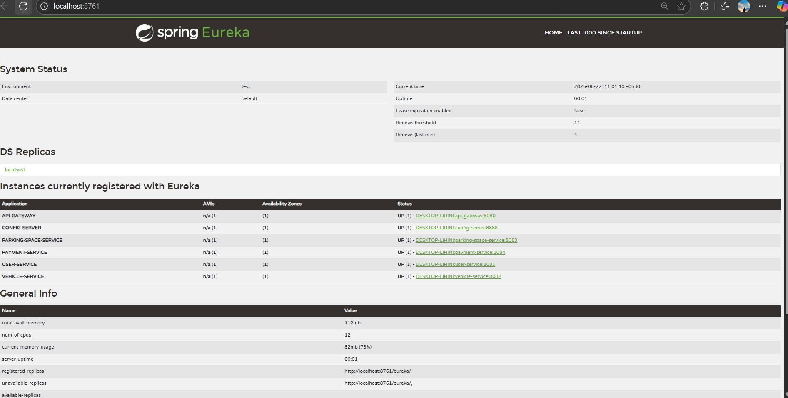

# Smart Parking Management System (SPMS)

A microservice-based application for managing parking spaces efficiently in urban environments.

## Project Overview

The Smart Parking Management System (SPMS) is a cloud-native, microservice-based platform designed to offer real-time management and monitoring of parking spaces. It allows users to easily locate, reserve, and pay for parking while helping parking owners manage their spaces effectively.

## Architecture

The system consists of the following microservices:

1. **Eureka Server** - Service registry for dynamic service discovery
2. **Config Server** - Centralized configuration management
3. **API Gateway** - Single entry point for all client requests
4. **Parking Space Service** - Manages parking spaces and availability
5. **Vehicle Service** - Handles vehicle operations and tracking
6. **User Service** - Manages user and owner information
7. **Payment Service** - Handles payment transactions

## Technology Stack

- Java 17
- Spring Boot 3.2.3
- Spring Cloud 2023.0.0
- Spring Cloud Eureka
- Spring Cloud Config
- Spring Cloud Gateway
- Maven
- Lombok

## Prerequisites

- Java 17 or higher
- Maven 3.6 or higher
- Git

## Getting Started

1. Clone the repository:
```bash
git clone https://github.com/lihiniapsara/AD2-FINAL-CW.git
cd AD2-FINAL-CW
```

2. Build the project:
```bash
mvn clean install
```

3. Start the services in the following order:
   - Eureka Server
   - Config Server
   - API Gateway
   - Other microservices

## API Documentation

The API documentation is available in the Postman collection:
[Postman Collection](./docs/postman/SMART_PARKING_MANAGEMENT.postman_collection.json)

## Service Registry

The Eureka dashboard showing all registered services:


## Features

- Real-time parking space availability tracking
- Dynamic space allocation
- Digital transactions and booking receipts
- User authentication and authorization
- Vehicle tracking and management
- Payment processing
- Historical logs and analytics


